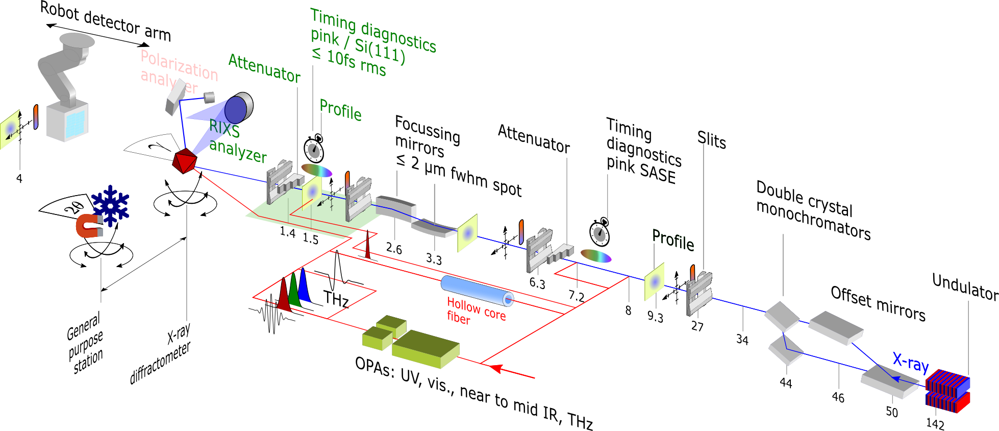

# Bernina beamline
## X-ray optical configuration

Bernina is located at the ARAMIS hard x-ray undulator of SwissFEL operatoing in the photon energy range of __2 keV to 12.5 keV__.
The Bernina beamline is using the center of 3 ARAMIS beamlines which is vertically offset by 20 mm from the direct undulator line:
- "Pink" mode, molybdenum coated Si offset mirrors
  - full FEL SASE Bandwidth typically ~0.2%
  - pulse energy typically 1 mJ
  - optional large Bandwidth mode up to 2% BW
- Monochromatic mode
  - Si(111)/Si(333) double crystal monochromator (1.3×10-4/9×10-8 BW)
  - Si(311) double crystal monochromator (2.8×10-5 BW)

At the experimental location the FEL beam has a size of about __1 to 0.5 mm (fwhm) over the ARAMIS energy range of 2 to 12 keV__. 
Typical pulse length in normal SASE mode is __50 fs (fwhm)__, which can be decresed by electron bunch tilting at the cost of pulse energy and beam profile quality (minumum ~10 fs).
Shorter pulses down to ~ 1 fs are available in special FEL modes (lower electron bunch charge).

The FEL beam can be focused by a pair Kirpatrick-Baez (KB) bendable mirrors (Mo-coated Si) to custom horizontal and vertical spot size at the sample interaction point, ranging from best focus below __2 µm (fwhm)__ to the full SASE beam size.
The FEL x-ray pointing downstream of the KB mirrors can be monitored and aligned by slits and profile monitors at two locations. 

<!-- Wavefront monitor -->

## X-ray diagnostics
The FEL beam is reproducibly aligned to the optical system by a system of slits/apertures and scintillator screens monitoring the beam profile.
During operation, the individual pulse intensity and pointing is continuously monitored by quadrant backstcattering detectors, reaching up to 1% single pulse noise for intensity measurement.

The single FEL pulse SASE spectrum can be continuously measured by a bent crystal spectrometer located upstream of the Bernina x-ray optical system.

## Pump/probe timing
In laser pump/x-ray probe experiments, the delay between pump and probe pulses is subject to drifts (of order 100fs / hour) and jitter at 100 Hz (of order 50 fs). Those can be compensated in most cases by feedback and data sorting using single pulse timing diagnostics. Two alternaitives of these timetools an be used, upstream or downstream of the KB mirror focuing element.

